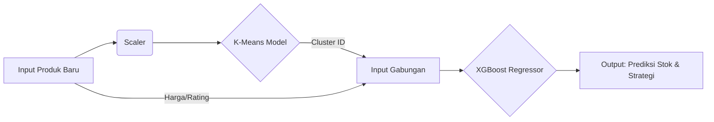

# Smart Stock Prediction & Segmentation System (Sociolla Case Study)

**Link:** **https://sociolla-appuct-intelligence-thmx5x6vffrhrwzszjj7h7.streamlit.app/**

## Overview

**Smart Stock Prediction System** adalah sebuah **Decision Support System (DSS)** berbasis AI yang dirancang untuk membantu Manajer Produk (khususnya di industri Skincare/Sociolla) dalam mengambil keputusan strategis sebelum meluncurkan produk baru (**New Product Introduction/NPI**).

Masalah utama yang diselesaikan sistem ini adalah **Cold-Start Problem**: Bagaimana memprediksi penjualan dan menentukan stok awal untuk produk yang _belum_ memiliki riwayat penjualan atau ulasan sama sekali?

### Key Features

1.  **Auto-Segmentation (K-Means):** Secara otomatis mengelompokkan produk baru ke dalam segmen pasar (e.g., _Viral Legends, Niche Luxury, Daily Drivers_) berdasarkan spesifikasi produk.
2.  **Sales Forecasting (XGBoost Regression):** Memprediksi estimasi jumlah pembelian ulang (_Repurchase Count_) per bulan.
3.  **Actionable Insight:** Memberikan rekomendasi stok (Safety Stock) dan strategi marketing berdasarkan prediksi risiko.

---

## System Workflow

Sistem ini menggabungkan _Unsupervised Learning_ dan _Supervised Learning_ dalam satu pipeline:

